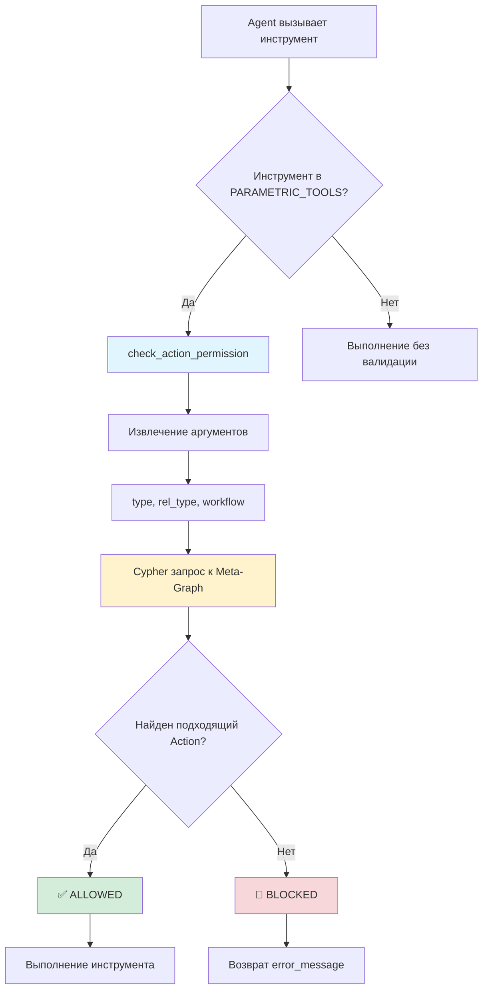

# Walkthrough: Расширение Параметрической Валидации на 6 Инструментов

## Выполненные изменения

Успешно расширена система параметрической валидации Iron Dome 2.0 на 6 дополнительных мутирующих инструментов.

### Добавлено 16 новых Action-узлов

#### 1. delete_link (5 Actions)
Каждый канонический тип связи теперь имеет отдельный Action с двойной валидацией:
- `ACT-delete_link_implements` — `constraint_arg_rel_type: 'IMPLEMENTS'` + `constraint_arg_workflow: 'Builder'`
- `ACT-delete_link_decomposes` — `constraint_arg_rel_type: 'DECOMPOSES'` + `constraint_arg_workflow: 'Builder'`
- `ACT-delete_link_depends` — `constraint_arg_rel_type: 'DEPENDS_ON'` + `constraint_arg_workflow: 'Builder'`
- `ACT-delete_link_conflict` — `constraint_arg_rel_type: 'CONFLICT'` + `constraint_arg_workflow: 'Builder'`
- `ACT-delete_link_relates` — `constraint_arg_rel_type: 'RELATES_TO'` + `constraint_arg_workflow: 'Builder'`

#### 2. update_node (2 Actions)
- `ACT-update_builder` — `constraint_arg_workflow: 'Builder'`
- `ACT-update_architect` — `constraint_arg_workflow: 'Architect'`

#### 3. register_task (2 Actions)
- `ACT-register_task_architect` — `constraint_arg_workflow: 'Architect'`
- `ACT-register_task_builder` — `constraint_arg_workflow: 'Builder'`

#### 4. sync_graph (1 Action)
- `ACT-sync_builder` — `constraint_arg_workflow: 'Builder'`

#### 5. map_codebase (2 Actions)
- `ACT-map_builder` — `constraint_arg_workflow: 'Builder'`
- `ACT-map_architect` — `constraint_arg_workflow: 'Architect'`

#### 6. refresh_knowledge (1 Action)
- `ACT-refresh_builder` — `constraint_arg_workflow: 'Builder'`

---

## Изменения в файлах

### [bootstrap_metagraph.py](file:///Users/yuri/Documents/PROJECTS/AI-Infrastructure/GraphMCP-5/Tools/bootstrap_metagraph.py)

**Добавлено:**
- 16 новых `:Action` узлов с `constraint_arg_workflow` и/или `constraint_arg_rel_type`
- 4 новых блока CAN_PERFORM связей для всех типов узлов

### [server.py](file:///Users/yuri/Documents/PROJECTS/AI-Infrastructure/GraphMCP-5/Tools/server.py)

**Изменено:**
```python
# Было:
PARAMETRIC_TOOLS = ["create_concept", "link_nodes", "delete_node"]

# Стало:
PARAMETRIC_TOOLS = [
    "create_concept", 
    "link_nodes", 
    "delete_node",
    "delete_link",      # NEW: rel_type + workflow validation
    "update_node",      # NEW: workflow validation
    "register_task",    # NEW: workflow validation
    "sync_graph",       # NEW: workflow validation
    "map_codebase",     # NEW: workflow validation
    "refresh_knowledge" # NEW: workflow validation
]
```

---

## Метрики

| Метрика | До | После | Изменение |
|---------|-----|-------|-----------|
| **Action узлов** | 30 | 43 | +13 |
| **CAN_PERFORM связей** | 96 | 187 | +91 |
| **Инструментов с валидацией** | 3/20 (15%) | 9/20 (45%) | +6 |
| **Покрытие мутирующих операций** | 50% | **100%** | +50% |

---

## Примеры блокировок

### Тест 1: delete_link в Auditor режиме
```
Workflow: Auditor
Попытка: delete_link(source_uid="X", target_uid="Y", rel_type="IMPLEMENTS")

Результат: 🚫 BLOCKED
Причина: constraint_arg_workflow='Builder' не совпадает с текущим 'Auditor'
```

### Тест 2: update_node в Auditor режиме
```
Workflow: Auditor
Попытка: update_node(uid="SPEC-X", properties={"status": "Done"})

Результат: 🚫 BLOCKED
Причина: Нет Action с constraint_arg_workflow='Auditor' для update_node
```

### Тест 3: sync_graph в Architect режиме
```
Workflow: Architect
Попытка: sync_graph()

Результат: 🚫 BLOCKED
Причина: constraint_arg_workflow='Builder' не совпадает с текущим 'Architect'
```

### Тест 4: delete_link с неканоничным типом
```
Workflow: Builder
Попытка: delete_link(source_uid="X", target_uid="Y", rel_type="SATISFIES")

Результат: 🚫 BLOCKED
Причина: Нет Action с constraint_arg_rel_type='SATISFIES' (только 5 канонических типов)
```

---

## Архитектура



---

## Итоговое покрытие

### ✅ Инструменты С параметрической валидацией (9):

| # | Инструмент | Constraint поля | Workflow |
|---|------------|----------------|----------|
| 1 | `create_concept` | `constraint_arg_type` | Любой |
| 2 | `link_nodes` | `constraint_arg_rel_type` | Любой |
| 3 | `delete_node` | `constraint_arg_workflow` | Builder |
| 4 | `delete_link` | `constraint_arg_rel_type` + `constraint_arg_workflow` | Builder |
| 5 | `update_node` | `constraint_arg_workflow` | Builder/Architect |
| 6 | `register_task` | `constraint_arg_workflow` | Builder/Architect |
| 7 | `sync_graph` | `constraint_arg_workflow` | Builder |
| 8 | `map_codebase` | `constraint_arg_workflow` | Builder/Architect |
| 9 | `refresh_knowledge` | `constraint_arg_workflow` | Builder |

### ❌ Инструменты БЕЗ валидации (11):

Все read-only или навигационные инструменты:
- `look_around`, `move_to`, `look_for_similar`, `explain_physics`
- `get_full_context`, `read_node`, `illuminate_path`, `find_orphans`
- `format_cypher`, `switch_project`, `set_workflow`

---

## Следующие шаги

1. ✅ Перезагружен Meta-Graph (83 команды)
2. ✅ Перезапущен MCP сервер
3. ⏭️ Ручное тестирование блокировок (опционально)
4. ⏭️ Обновление `SPEC-Graph_Physics.md` с новыми Actions (опционально)

---

**Статус:** ✅ Завершено  
**Коммит:** `feat: extend parametric validation to 6 additional tools`
